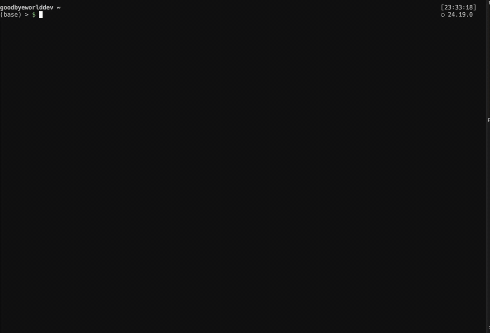

# Codex Tmux Central

A small terminal dashboard for running multiple Codex CLI sessions in one stable tmux workspace.

```text
 codex  0:codex-central  1:blog 🟡 WORK 🤖2  2:api 🔴 INPUT
```

It uses tmux plus official Codex lifecycle hooks. There is no background service, telemetry, or hosted dependency.



## What it provides

- one persistent `codex` tmux session;
- a launcher shell at `0:codex-central`;
- one tmux window per Codex session and project;
- `🟡 WORK`, `🟢 WAIT`, and `🔴 INPUT` status labels;
- active subagent count and type, such as `🤖1 reviewer`;
- automatic project-directory window names;
- mouse scrolling with 50,000 lines of history;
- `Ctrl-b` + Left/Right navigation;
- a `tcodex <directory>` launcher;
- a shell that remains open after Codex exits.

## Requirements

- macOS or Linux;
- [Codex CLI](https://developers.openai.com/codex/cli/);
- tmux;
- [Bun](https://bun.sh/) for the hook and installer;
- zsh for the `tcodex` launcher;
- optional: zoxide for fuzzy project lookup.

On macOS with Homebrew:

```bash
brew install tmux bun
```

## Install

```bash
git clone https://github.com/goodbye-world-dev/codex-tmux-central.git
cd codex-tmux-central
bun run install.ts
```

The installer:

- preserves existing `~/.tmux.conf`, `~/.zshrc`, and `~/.codex/hooks.json` content;
- adds clearly marked managed blocks to tmux and zsh configuration;
- merges its handlers into existing Codex hooks;
- installs the hook at `~/.codex/hooks/tmux-status.ts`;
- stores backups under `~/.codex-tmux-central/backups/`.

Preview changes without writing:

```bash
bun run install.ts --dry-run
```

Then reload your shell and tmux configuration:

```bash
source ~/.zshrc
tmux source-file ~/.tmux.conf
```

Start a new Codex CLI process, enter `/hooks`, review the new command hooks, and trust them. Codex intentionally requires review whenever a non-managed hook definition changes. See the [official Codex hooks documentation](https://learn.chatgpt.com/docs/hooks).

## Usage

Open a project:

```bash
tcodex ~/projects/my-project
```

If the project is under `~/projects` or `~/workspace`, its directory name is enough:

```bash
tcodex my-project
```

With no argument, `tcodex` uses the current directory:

```bash
tcodex
```

On the first run, it creates:

```text
0:codex-central   persistent launcher shell
1:my-project      Codex running in the project
```

Later runs add more project windows to the same tmux session. When called from another tmux session, `tcodex` works inside that current session and safely places `codex-central` at index 0.

## Navigation

| Action | Keys or command |
| --- | --- |
| Next/previous window | `Ctrl-b`, then Left/Right |
| Window by index | `Ctrl-b`, then `0`-`9` |
| Rename window | `Ctrl-b`, then `,` |
| Detach | `Ctrl-b`, then `d` |
| Reattach | `tmux attach -t codex` |
| Scroll | mouse/trackpad, or `Ctrl-b`, then `[` |
| Close window | `Ctrl-b`, then `&` |

When you exit Codex with `Ctrl+C`, the project window remains open at its shell prompt.

## Status labels

| Label | Meaning |
| --- | --- |
| `🟡 WORK` | Codex is processing a turn |
| `🟢 WAIT` | Codex finished and is waiting for input |
| `🔴 INPUT` | Codex is requesting approval |
| `🤖N` | N subagents are active |

## Configuration

Optional environment variables:

```bash
export TCODEX_SESSION_NAME=codex
export TCODEX_CENTRAL_NAME=codex-central
export TCODEX_COMMAND=codex
export TCODEX_PROJECT_ROOTS="$HOME/projects:$HOME/workspace"
```

`TCODEX_COMMAND` is entered into the project shell, so it may include normal Codex CLI arguments.

## Security and privacy

- The hook does not make network requests.
- It does not persist prompt or assistant text.
- It uses only lifecycle event names, session IDs, and subagent IDs/types.
- Temporary agent-count state is stored under the operating system's temporary directory.
- Hook commands must be explicitly reviewed and trusted through `/hooks`.
- The installer makes backups before changing existing files.

Review `install.ts`, `src/tmux-status.ts`, and the snippets before installing. Never run configuration installers you have not inspected.

## Uninstall

The installer prints the exact backup directory used for each run. Restore the backed-up files from the newest directory, or remove the marked `codex-tmux-central` blocks from `~/.tmux.conf` and `~/.zshrc`, remove its handlers from `~/.codex/hooks.json`, and delete:

```text
~/.codex/hooks/tmux-status.ts
~/.config/codex-tmux-central/tcodex.zsh
```

## License

MIT
